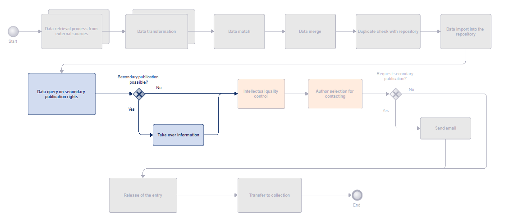
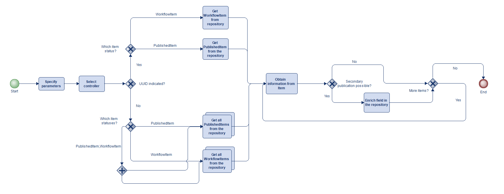

# Aurora Enricher

## Version
This code is compatible with DSpace versions 8.1+ and 7.6.2+. For earlier versions, please use the code from the enricher-1.0 tag.

## About
The Enricher was developed as a second tool by the ZHAW Zurich University of Applied Sciences and the University of Applied Sciences and Arts Northwestern Switzerland FHNW as part of the AURORA project co-financed by swissuniversities. The tool is used to enrich publications in the DSpace repository with information on secondary publication. The corresponding data can come from sources such as Open policy finder Jisc (formerly SherpaRomeo) or a CSV list.



## Table of contents
- [ Sequence of the enricher tool](#sequence-of-the-enricher-tool)
    - [Enrichment with UUID](#enrichment-with-uuid)
    - [Enrichment without UUID](#enrichment-without-uuid)
- [Prerequisites](#prerequisites)
- [Installation](#installation)
- [Usage](#usage)
    - [Syntax](#syntax)
    - [Options](#options)
    - [Examples](#examples)
- [Configurations](#configurations)
- [Controllers](#controllers)
    - [EnrichmentControllerAbstract](#enrichmentcontrollerabstract)
    - [SherpaRomeoController](#sherparomeocontroller)
    - [CSVController](#csvcontroller)
- [Models](#models)
    - [EnrichmentModel](#enrichmentmodel)
    - [ItemModel](#itemmodel)
- [Organisation](#organisation)
    - [Controller](#controller)
    - [Services](#services)
        - [Item](#item)
        - [Provider](#provider)
- [Services](#services-1)
- [Best practice](#best-practice)
    - [Example of a policies CSV file](#example-of-a-policies-csv-file)


## Sequence of the Enricher tool
The Enricher tool supplements publications in the DSpace repository with information on secondary publication rights by specifically entering this data into a defined metadata field. The two states in which publications can be located must be taken into account: Published Items and Workflow Items. Depending on the state, different processes are required to carry out the enrichment correctly. This is due to the specific requirements that DSpace places on the processing of these states.

At the beginning, the method checks whether a specific UUID (a unique identification number) has been specified for an item. 

### Enrichment with UUID

If a UUID is available, the method searches specifically for this item. A service object is used to retrieve the current state of the item from the DSpace repository. If the item with the given UUID is found, the tool enriches it with information on the general conditions of secondary publication. This information is added to a corresponding metadata field of the publication in the DSpace repository. If the enrichment of the item fails, the item is saved in a CSV file for further analysis and an error message is displayed. If the item is not found, a corresponding response is also issued.

### Enrichment without UUID

If no UUID is specified, the tool performs the enrichment across all items of the specified states and also adds the information on the secondary publication to the corresponding metadata field of the publications in DSpace.



## Prerequisites
- Java version 17
- Repository in DSpace 7.6.2+ / 8.1+

## Installation
- Preparations in DSpace - create secondary publishing rights field, set rights (admin)
- Get project from Github
- Make adjustments to the configuration and classes
- Create the JAR file with this command:
   ```
   mvn clean package
   ```
- Carry out process integration in DSpace

## Usage
### Syntax
Execute the command in the following format:

```bash
 java -jar ./target/enricher-jar-with-dependencies.jar -controller [option] -items [option] -id [option]
```

### Options
| flag | description                                     | mandatory |
|------|-------------------------------------------------|-----------|
| `-controller` | The name of the controller to be used.<br> <br>For example: <br>SherpaRomeoController  | Yes       |
| `-items` |   The state of item(s). WorkflowItem, PublishedItem or both.  | Yes |
| `-id` | The UUID of an item from the repository.| No |
### Examples
```bash
-controller CSVController -items WorkflowItem -id 8032f56a-8b1a-4edd-ae44-17ab8b51bf17

-controller SherpaRomeoController -items PublishedItem

-controller SherpaRomeoController -items PublishedItem,WorkflowItem
```

## Configurations
In ./src/main/resources/assets/config/organisation.properties
| field name      | description  | mandatory  | example  |
| ------------- | ------------- | ------------- |------------- |
|type.{providerName}.{typeOfPublication}|Name of the type of publication in the repository. The typeOfPublication can be chosen freely, but should occur only once per provider.|Yes|type.sherpa.journalArticle = Beitrag in wissenschaftlicher Zeitschrift|
|matchString.{providerName}.location|A range of publishing options where secondary publishing is permitted. Different locations are separated with \|.|Yes for SherpaRomeo.|matchString.sherpa.location = Any Repository\|Any Website\|Institutional Repository\|Non-Commercial Repository\|Non-Commercial Institutional Repository|
|matchString.{providerName}.version|Accepted document versions, different version types are separated with \|.|Yes for SherpaRomeo.|matchString.sherpa.version = Published\|Accepted|
|metadata.{providerName}|Metadata field in the repository where the information on the secondary publication is to be saved.|Yes|metadata.sherpa = zhaw.oastatus.aurora|
|metadata.{providerName}.section|The section in the repository of the metadata field that stores the secondary publication information. |Yes, unless the section is set dynamically.|metadata.sherpa.section = zhawdescriptionclassic|
|url.{providerName}|The URL of the provider's API.|Yes for SherpaRomeo|url.sherpa =  https://v2.sherpa.ac.uk/cgi/retrieve_by_id/cgi/retrieve_by_id?item-type=publication&format=Json|
|organisation.repositoryAPI| The URL of the server API of the repository.|Yes|https://digitalcollection.zhaw.ch/server/api|
|organisation.policyList |The path to the list with the information on the secondary publication.|Yes for CSVController.|organisation.policyList = files/input/self-archiving-policies.csv|
|organisation.unsuccessfulItemList|The path to the list of items for which the enrichment was unsuccessful.|Yes|organisation.unsuccessfulItemList = /path/to/output/folder/unsuccessful-item-list.csv|
|organisation.itemsPerPage|How many items per page should be queried by the API.|Yes|organisation.itemsPerPage = 100|
|dspace.version|DSpace Version to set how the csrf token is received.|Yes|dspace.version = 7.6.0|

To be able to enrich the metadata field, a user with admin and workflow rights is created with access to the items in the repository.

In ./src/main/resources/assets/config/credentials.properties

| field name      | description  | mandatory  | example  |
| ------------- | ------------- | ------------- |------------- |
|username|The user email.|Yes|manumusterperson@muster.ch|
|password|The password of the user.|Yes|admin123|
|apikey.sherpa|The api key of SherpaRomeo.|Yes|XXX-XXX|

## Controllers

./src/main/java/ch/zhaw/hsb/aurora/enricher/Controller

The controllers forward user requests to the corresponding services and coordinate tasks such as retrieving items, requesting information from the provider and preparing the data for import into the corresponding fields.

### EnrichmentControllerAbstract
The EnrichmentControllerAbstract is an abstract controller that provides all the standard functions of a controller. As an abstract class, EnrichmentControllerAbstract itself cannot be instantiated. Instead, SherpaRomeoController and CSVController are instantiated.
### SherpaRomeoController
The SherpaRomeoController inherits all the functions of the OrganisationControllerAbstract, which in turn inherits from the EnrichmentControllerAbstract, and enables the services for the provider SherpaRomeo to be adapted and called.
### CSVController
The CSVController inherits all the functions of the OrganisationControllerAbstract, which in turn inherits from the EnrichmentControllerAbstract, and enables the services for the CSV file to be adapted and called.

## Models
./src/main/java/ch/zhaw/hsb/aurora/enricher/Model

### EnrichmentModel
The EnrichmentModel class represents a data model that is used to temporarily store the information for secondary publication that originates from a policy. The following data is recorded:

- version: The document version for which secondary publication is permitted.
- embargoAmount and embargoUnit: The embargo period for access to the document, where embargoAmount specifies the numerical duration and embargoUnit specifies the unit (e.g. months or years).
- licence: The licence for a secondary publication.
- uri: The URI of the policy.

The class contains getter and setter methods to access and modify the individual fields, which enables flexible data manipulation.

### ItemModel
The abstract ItemAbstract class serves as a base class from which two concrete classes are derived: PublishedItem and WorkflowItem. These classes represent different types of ‘items’ in the repository and inherit common attributes and methods from ItemAbstract, which provide them with a standardised structure and functionality.

- id: A unique ID of the item. For example, the workflow ID, which is different from the UUID.
- uuid: A unique identifier (UUID) to identify the item, regardless of which stage of the workflow the item is in.
- issn: The International Standard Serial Number (ISSN) of the journal of the item.
- publisher: The name of the publisher or institution that published the item.
- type: The publication type (e.g. article, book) of the item.

The class contains getter and setter methods for accessing the attributes and enabling data manipulation.

As an abstract class, ItemAbstract itself cannot be instantiated. Instead, PublishedItem and WorkflowItem are used to represent the respective items. Both classes inherit the common attributes and methods, but can contain additional, specialised attributes or methods that are necessary for their specific requirements.

## Organisation
./src/main/java/ch/zhaw/hsb/aurora/enricher/Organisation

The organisation folder contains classes that can be modified to adapt the tool to your repository's specific requirements.

### Controller

The OrganisationControllerAbstract class is an abstract controller class that inherits from the parent class EnrichmentControllerAbstract. It is responsible for controlling organisation-specific logic.

In our example, the class is empty. However, it can be extended to, for example, dynamically design queries for sections of the metadata field.

As an abstract class, OrganisationControllerAbstract cannot be instantiated directly, so the provider controllers inherit from it.

### Services

#### Item
The OrganisationItemServiceAbstract class is an abstract service class that inherits from the higher-level ItemServiceAbstract class. It contains a method for preparing the input for the metadata field.

The abstract class OrganisationItemServiceAbstract cannot be instantiated directly. Instead, it serves as the basis for items that are in different states such as PublishedItem or WorkflowItem.

#### Provider
A separate service is created for each provider. The OrganisationCSVService and OrganisationSherpaRomeoService define how the EnrichmentModel is to be filled with the data. The OrganisationSherpaRomeoService also defines how the output from SherpaRomeo is processed, including the pre-processing of the data and the application of exclusion criteria.


## Services

./src/main/java/ch/zhaw/hsb/aurora/enricher/Service

All services required for processing files, items, providers and requests to the repository are stored in the service folder. The abstract service classes, which can be overwritten in the organisation folder, are also located here.

- File: Contains functions that enable CSV files to be read and manipulated.
- Item: Contains the functionalities for items as well as the specific functions of the individual item states such as WorkflowItem and PublishedItem.
- Provider: Includes the functions of the provider services that define how the information is retrieved for secondary publication. In our examples, the SherpaRomeoService searches for the corresponding policies using the ISSN of the publication, while the CSVService searches in the Policies CSV for policies based on the name of the publisher and the publication type. 
- Request: Contains the functions for requesting and querying the repository.

## Best practice

Once the metadata field in the repository has been supplemented with information on the secondary publication of the items, this information can be found specifically via the search in the repository. It is then possible to contact the relevant authors to request the full texts of the publications in question and make them available for publication.

### Example of a Policies-CSV file

./src/main/resources/files/input/self-archiving-policies.csv

The file contains detailed information on secondary publications, documented per publisher and publication type. 

The information recorded includes the same information that is stored in the EnrichmentModel. A free text field called Comments is available for additional comments or notes that are not covered by the standardised fields. Finally, the date of the last check of the information entered is recorded in the Last Check field to ensure that the data is up-to-date and correct.

| Publisher                           | PublicationType | Version   | EmbargoAmount | EmbargoUnit | License | URL                                               | Comments                                                                                                                                                                                                                             | Last Check   |
|----------------------------------|-----------------|-----------|---------------|-------------|---------|---------------------------------------------------|-------------------------------------------------------------------------------------------------------------------------------------------------------------------------------------------------------------------------------------|--------------|
| Routledge | Buchbeitrag      | Accepted  | 12             | Months      |    CC BY-NC-ND     | [https://www.routledge.com/our-products/open-access-books/publishing-oa-books/chapters](https://www.routledge.com/our-products/open-access-books/publishing-oa-books/chapters) | "One chapter per author. Credit line: This is an Accepted Manuscript of a book chapter published by Routledge/CRC Press in [BOOK TITLE] on [date of publication], available online: http://www.routledge.com/[BOOK ISBN URL] or http://www.crcpress.com/[BOOK ISBN URL]." | 02.08.2024   |

