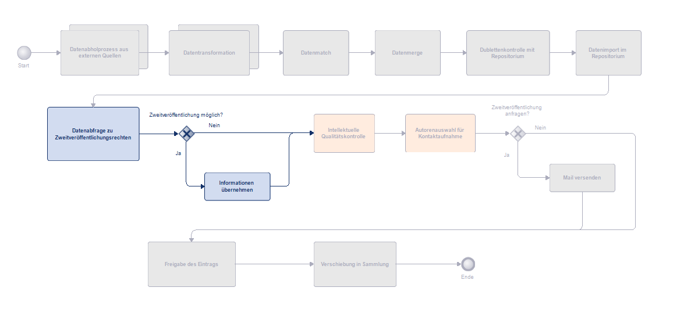
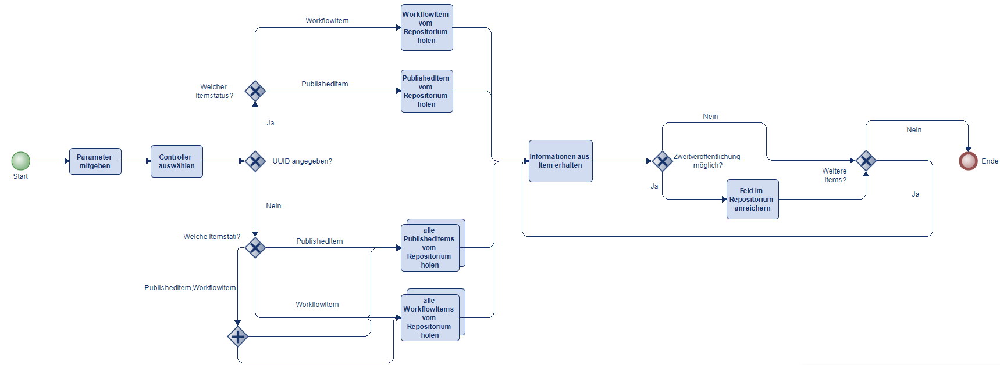

# Aurora Enricher

## Version
Dieser Code funktioniert mit DSpace Version 8.1+ und 7.6.2+. Für ältere Versionen nutzen Sie bitte den Code aus dem Tag enricher-1.0.

## Über
Der Enricher wurde im Rahmen des von swissuniversities ko-finanzierten Projekts AURORA als zweites Tool von der ZHAW Zürcher Hochschule für Angewandte Wissenschaften und der Fachhochschule Nordwestschweiz FHNW entwickelt. Das Tool wird zur Anreicherung von Publikationen im DSpace-Repositorium mit Informationen zur Zweitveröffentlichung eingesetzt. Die entsprechenden Daten können unter anderem aus Quellen wie Open policy finder Jisc (ehemals SherpaRomeo) oder einer eigenen CSV-Liste stammen.



## Inhaltsverzeichnis
- [Ablauf des Enricher-Tools](#ablauf-des-enricher-tools)
    - [Anreicherung mit UUID](#anreicherung-mit-uuid)
    - [Anreicherung ohne UUID](#anreicherung-ohne-uuid)
- [Voraussetzungen](#voraussetzungen)
- [Installation](#installation)
- [Verwendung](#verwendung)
    - [Syntax](#syntax)
    - [Optionen](#optionen)
    - [Beispiele](#beispiele)
- [Konfigurationen](#konfigurationen)
- [Controllers](#controllers)
    - [EnrichmentControllerAbstract](#enrichmentcontrollerabstract)
    - [SherpaRomeoController](#sherparomeocontroller)
    - [CSVController](#csvcontroller)
- [Models](#models)
    - [EnrichmentModel](#enrichmentmodel)
    - [ItemModel](#itemmodel)
- [Organisation](#organisation)
    - [Controller](#controller)
    - [Services](#services)
        - [Item](#item)
        - [Provider](#provider)
- [Services](#services-1)
- [Best practice](#best-practice)
    - [Beispiel einer Policies-CSV Datei](#beispiel-einer-policies-csv-datei)

## Ablauf des Enricher-Tools
Das Enricher-Tool ergänzt Publikationen im DSpace-Repository mit Informationen zu Zweitveröffentlichungsrechten, indem diese gezielt in ein festgelegtes Metadatenfeld eingetragen werden. Dabei müssen die beiden Zustände berücksichtigt werden, in denen sich Publikationen befinden können: Published Items und Workflow Items. Je nach Zustand sind unterschiedliche Prozesse erforderlich, um die Anreicherung korrekt durchzuführen. Dies liegt an der spezifischen Anforderung, die DSpace an die Bearbeitung dieser Zustände stellt.

Zu Beginn überprüft die Methode, ob eine spezifische UUID (eine eindeutige Identifikationsnummer) für ein Item angegeben wurde. 

### Anreicherung mit UUID

Wenn eine UUID vorhanden ist, sucht die Methode gezielt nach diesem Item. Hierbei wird ein Service-Objekt verwendet, das den aktuellen Zustand des Items aus dem DSpace-Repositorium holt. Wird das Item mit der gegebenen UUID gefunden, reichert das Tool dieses Item mit Informationen zu Rahmenbedingungen der Zweitveröffentlichung an. Diese Informationen werden in einem entsprechenden Metadatenfeld der Publikation im DSpace-Repositorium hinzugefügt. Sollte die Anreicherung des Items fehlschlagen, wird das Item zur weiteren Analyse in einer CSV-Datei gespeichert und eine Fehlermeldung ausgegeben. Wird das Item nicht gefunden, erfolgt ebenfalls eine entsprechende Rückmeldung.

### Anreicherung ohne UUID

Falls keine UUID angegeben wird, führt das Tool die Anreicherung über alle Items der mitgegebenen Zustände durch und fügt ebenfalls die Informationen zur Zweitveröffentlichung in das entsprechende Metadatenfeld der Publikationen in DSpace hinzu.



## Voraussetzungen
- Java Version 17
- Repositorium in DSpace 7.6.2+ / 8.1+


## Installation
- Vorbereitungen im DSpace – Zweitveröffentlichungsrechte-Feld erstellen, Rechte setzen (Admin)
- Projekt von Github holen
- Anpassungen in der Konfiguration und den Klassen vornehmen
- die JAR-Datei mit diesem Befehl erstellen:
   ```
   mvn clean package
   ```
- Prozesseinbindung im DSpace durchführen

## Verwendung
### Syntax
Führen Sie den Befehl in folgendem Format aus:

```bash
 java -jar ./target/enricher-jar-with-dependencies.jar -controller [option] -items [option] -id [option]
```

### Optionen
| Flag | Beschreibung                                     | Pflicht |
|------|-------------------------------------------------|-----------|
| `-controller` | Der Name des Controllers, welcher verwendet werden soll.<br> <br>Zum Beispiel: <br>SherpaRomeoController  | Ja       |
| `-items` |   Die Art des/der Items. WorkflowItem, PublishedItem oder beide.  | Ja |
| `-id` | Die UUID eines Items aus dem Repositorium.| Nein |
### Beispiele
```bash
-controller CSVController -items WorkflowItem -id 8032f56a-8b1a-4edd-ae44-17ab8b51bf17

-controller SherpaRomeoController -items PublishedItem

-controller SherpaRomeoController -items PublishedItem,WorkflowItem
```

## Konfigurationen
Im ./src/main/resources/assets/config/organisation.properties
| Feldname      | Beschreibung  | Pflicht  | Beispiel  |
| ------------- | ------------- | ------------- |------------- |
|type.{providerName}.{typeOfPublication}|Name des Typs der Publikation im Repositorium. Der typeOfPublication kann frei gewählt werden, , sollte jedoch je Provider nur einmal vorkommen.|Ja|type.sherpa.journalArticle = Beitrag in wissenschaftlicher Zeitschrift|
|matchString.{providerName}.location|Eine Reihe von Veröffentlichungsoptionen, wo eine Zweitveröffentlichung gestattet ist. Verschiedene Orte werden mit \| getrennt.|Ja für SherpaRomeo.|matchString.sherpa.location = Any Repository\|Any Website\|Institutional Repository\|Non-Commercial Repository\|Non-Commercial Institutional Repository|
|matchString.{providerName}.version|Akzeptierte Dokumentenversionen, verschiedene Versionstypen werden mit \| getrennt.|Ja für SherpaRomeo.|matchString.sherpa.version = Published\|Accepted|
|metadata.{providerName}|Metadatenfeld im Repositorium,wo die Informationen zur Zweitveröffentlichung gespeichert werden sollen.|Ja|metadata.sherpa = zhaw.oastatus.aurora|
|metadata.{providerName}.section|Die Sektion im Repository des Metadatenfeldes, welches die Informationen zur Zweitveröffentlichung speichert. |Ja, ausser die Section wird dynamisch festgelegt.|metadata.sherpa.section = zhawdescriptionclassic|
|url.{providerName}|Die URL der API des Providers.|Ja für SherpaRomeo|url.sherpa =  https://v2.sherpa.ac.uk/cgi/retrieve_by_id/cgi/retrieve_by_id?item-type=publication&format=Json|
|organisation.repositoryAPI| URL der Server API des Repositoriums.|Ja|https://digitalcollection.zhaw.ch/server/api|
|organisation.policyList |Der Pfad zur Liste mit den Informationen zur Zweitveröffentlichung.|Ja für CSV Controller.|organisation.policyList = files/input/self-archiving-policies.csv|
|organisation.unsuccessfulItemList|Der Pfad zur Liste mit den Items, bei denen die Anreicherung erfolglos war.|Ja|organisation.unsuccessfulItemList = /pfad/zum/output/ordner/unsuccessful-item-list.csv|
|organisation.itemsPerPage|Wie viele Items pro Seite von der API abgefragt werden sollen.|Ja|organisation.itemsPerPage = 100|
|dspace.version|DSpace Version, um festzulegen, wie das csrf-Token empfangen wird.|Yes|dspace.version = 7.6.0|


Um das Metadatenfeld anreichern zu können, wird im Repositorium ein Benutzer mit Admin- und Workflow-Rechten angelegt, der Zugriff auf die Items hat.

Im ./src/main/resources/assets/config/credentials.properties

| Feldname      | Beschreibung  | Pflicht  | Beispiel  |
| ------------- | ------------- | ------------- |------------- |
|username|Der Benutzeremail des Users.|Ja|manumusterperson@muster.ch|
|password|Das Passwort des Users.|Ja|admin123|
|apikey.sherpa|Der API Schlüssel für SherpaRomeo.|Ja|XXX-XXX|


## Controllers

./src/main/java/ch/zhaw/hsb/aurora/enricher/Controller

Die Controller leiten Nutzeranfragen an die entsprechenden Services weiter und koordinieren Aufgaben wie das Abrufen von Items, das Abfragen von Informationen beim Provider und die Aufbereitung der Daten für die Einspielung in die entsprechenden Felder.

### EnrichmentControllerAbstract
Der EnrichmentControllerAbstract ist ein abstrakter Controller, der alle Standardfunktionen eines Controllers bereitstellt. Als abstrakte Klasse kann EnrichmentControllerAbstract selbst nicht instanziiert werden. Stattdessen werden SherpaRomeoController und CSVController instanziiert.
### SherpaRomeoController
Der SherpaRomeoController erbt alle Funktionen des OrganisationControllerAbstract, das wiederum vom EnrichmentControllerAbstract erbt, und ermöglicht die Services für den Provider SherpaRomeo anzupassen und aufzurufen.
### CSVController
Der CSVController erbt alle Funktionen des OrganisationControllerAbstract, das wiederum vom EnrichmentControllerAbstract erbt, und ermöglicht die Services für die CSV-Datei anzupassen und aufzurufen.

## Models
./src/main/java/ch/zhaw/hsb/aurora/enricher/Model

### EnrichmentModel
Die Klasse EnrichmentModel repräsentiert ein Datenmodell, das dazu dient, die Informationen zur Zweitveröffentlichung zwischenzuspeichern, welche von einer Policy stammen. Folgende Daten werden dabei erfasst:

- version: Die Dokumentenversion, für welche eine Zweitveröffentlichung erlaubt ist.
- embargoAmount und embargoUnit: Die Sperrfrist (Embargo) für den Zugang zum Dokument, wobei embargoAmount die numerische Dauer und embargoUnit die Einheit (z. B. Monate oder Jahre) angibt.
- license: Die Lizenz einer Zweitveröffentlichung.
- uri: Die URI der Policy.

Die Klasse enthält Getter- und Setter-Methoden, um auf die einzelnen Felder zuzugreifen und sie zu modifizieren, was eine flexible Datenmanipulation ermöglicht.

### ItemModel
Die abstrakte Klasse ItemAbstract dient als Basisklasse, von der zwei konkrete Klassen abgeleitet werden: PublishedItem und WorkflowItem. Diese Klassen repräsentieren unterschiedliche Arten von "Items" im Repositorium und erben gemeinsame Attribute und Methoden von ItemAbstract, die ihnen eine einheitliche Struktur und Funktionalität bieten.


- id: Eine eindeutige ID des Items. Zum Beispiel die Workflow ID, welche sich von der UUID unterscheidet.
- uuid: Ein eindeutiger Bezeichner (UUID) zur Identifizierung des Items, unabhängig davon, in welchem Stadium des Workflows sich das Item befindet.
- issn: Die International Standard Serial Number (ISSN) des Journals des Items.
- publisher: Der Name des Verlags oder der Institution, die das Item veröffentlicht hat.
- type: Der Der Publikationstyp (z.B. Artikel, Buch) des Items.

Die Klasse enthält Getter- und Setter-Methoden für den Zugriff auf die Attribute und die Datenmanipulation erlauben.

Als abstrakte Klasse kann ItemAbstract selbst nicht instanziiert werden. Stattdessen werden PublishedItem und WorkflowItem verwendet, um die jeweiligen Items darzustellen. Beide Klassen erben die gemeinsamen Attribute und Methoden, können jedoch zusätzliche, spezialisierte Attribute oder Methoden enthalten, die für ihre spezifischen Anforderungen notwendig sind.

## Organisation
./src/main/java/ch/zhaw/hsb/aurora/enricher/Organisation

Im Organisations-Ordner befinden sich die Klassen, welche modifiziert werden können, um das Tool an die eigenen Anforderungen des Repositoriums anzupassen.

### Controller

Die Klasse OrganisationControllerAbstract ist eine abstrakte Controller-Klasse, die von der übergeordneten Klasse EnrichmentControllerAbstract erbt. Sie ist für die Steuerung von organisations-spezifischen Logiken zuständig.

In unserem Beispiel ist die Klasse leer. Es gibt hier jedoch die Möglichkeiten Erweiterungen hinzuzufügen, wie zum Beispiel die Abfrage der Section des Metadatenfeldes dynamisch zu gestalten.

Als abstrakte Klasse kann OrganisationControllerAbstract nicht direkt instanziiert werden, sodass die Provider Controller von ihr erben.

### Services

#### Item
Die Klasse OrganisationItemServiceAbstract ist eine abstrakte Service-Klasse, die von der übergeordneten Klasse ItemServiceAbstract erbt. Sie enthält eine Methode zur Vorbereitung des Inputs für das Metadatenfeld.

Die abstrakte Klasse OrganisationItemServiceAbstract kann nicht direkt instanziiert werden. Sie dient vielmehr als Grundlage für Items, die sich in verschiedenen Zuständen wie PublishedItem oder WorkflowItem befinden.

#### Provider
Für jeden Provider wird ein eigener Service erstellt. Im OrganisationCSVService und im OrganisationSherpaRomeoService wird festgelegt, wie das EnrichmentModel mit den Daten befüllt werden soll. Der OrganisationSherpaRomeoService definiert zusätzlich, wie der Output von SherpaRomeo verarbeitet wird, einschließlich der Vorverarbeitung der Daten und der Anwendung von Ausschlusskriterien.


## Services

./src/main/java/ch/zhaw/hsb/aurora/enricher/Service

Im Service-Ordner sind alle Services abgelegt, die für die Bearbeitung von Dateien, Items, Providern und Anfragen ans Repositorium erforderlich sind. Hier befinden sich auch die abstrakten Service-Klassen, die im Organisationsordner überschrieben werden können.

- File: Enthält Funktionen, die das Lesen und Manipulieren von CSV-Dateien ermöglichen.
- Item: Beinhaltet die Funktionalitäten für Items sowie die spezifischen Funktionen der einzelnen Itemzustände wie WorkflowItem und PublishedItem.
- Provider: Umfasst die Funktionen der Provider-Services, die definieren, wie die Informationen zur Zweitveröffentlichung abgerufen werden. In unseren Beispielen sucht der SherpaRomeoService mithilfe der ISSN der Publikation nach den entsprechenden Policies, während der CSVService im Policies-CSV nach Policies sucht, die auf dem Namen des Publishers und dem Publikationstyp basieren. 
- Request: Beinhaltet die Funktionen zum An- und Abfragen des Repositoriums.


## Best practice

Nachdem das Metadatenfeld im Repositorium um Informationen zur Zweitveröffentlichung der Items ergänzt wurde, können diese Informationen über die Suche im Repositorium gezielt gefunden werden. Anschließend besteht die Möglichkeit, die entsprechenden Autoren zu kontaktieren, um die Volltexte der betreffenden Publikationen anzufordern und zur Veröffentlichung bereitzustellen.

### Beispiel einer Policies-CSV Datei

./src/main/resources/files/input/self-archiving-policies.csv

Die Datei enthält umfassende Informationen zu den Zweitveröffentlichungen, die pro Verlag und Publikationstyp dokumentiert sind. 

Zu den erfassten Informationen gehören dieselben Informationen, welche im EnrichmentModel hinterlegt werden. Für zusätzliche Anmerkungen oder Hinweise, die nicht durch die standardisierten Felder abgedeckt werden, steht ein Freitextfeld namens Comments zur Verfügung. Abschließend wird im Feld Last Check das Datum der letzten Überprüfung der eingetragenen Informationen festgehalten, um sicherzustellen, dass die Daten aktuell und korrekt sind.

| Publisher                           | PublicationType | Version   | EmbargoAmount | EmbargoUnit | License | URL                                               | Comments                                                                                                                                                                                                                             | Last Check   |
|----------------------------------|-----------------|-----------|---------------|-------------|---------|---------------------------------------------------|-------------------------------------------------------------------------------------------------------------------------------------------------------------------------------------------------------------------------------------|--------------|
| Routledge | Buchbeitrag      | Accepted  | 12             | Months      |    CC BY-NC-ND     | [https://www.routledge.com/our-products/open-access-books/publishing-oa-books/chapters](https://www.routledge.com/our-products/open-access-books/publishing-oa-books/chapters) | "One chapter per author. Credit line: This is an Accepted Manuscript of a book chapter published by Routledge/CRC Press in [BOOK TITLE] on [date of publication], available online: http://www.routledge.com/[BOOK ISBN URL] or http://www.crcpress.com/[BOOK ISBN URL]." | 02.08.2024   |